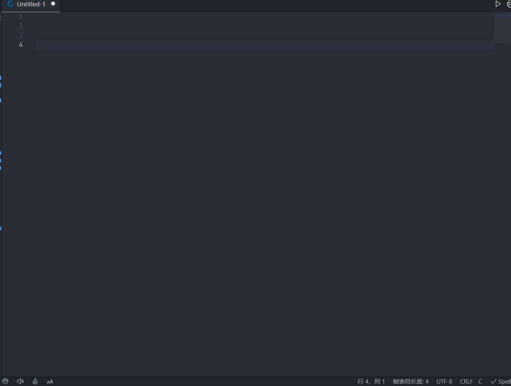

# vscode-ihyperdb-snippet 插件说明 README

This is the README for extension "vscode-ihyperdb-snippet". 
这是 vscode-ihyperdb-snippet 插件的说明文档

## 功能 Features

此插件提供 iHyperDB 计算点表达式的 常见逻辑语法、函数、常用代码的补全

表达式文档见：[iHyperDB手册-计算点表达式](https://product.baosight.com/wp-content/uploads/doc/ihdonline/index.html)

下方说明格式
说明：补全需要输入的关键词 1 / 关键词 2 / ... / 关键词 n
(输入**任意一个关键词的一部分**就能能显示相应的补全选项)

1. 常见逻辑语法补全
   
   1. `if...else`指令：ihdifelse / ihdifel
   2. `if...elseif...`指令：ihdifelif / ihdifelseif
   3. `Condition`(三元运算符)指令：ihdCondition
2. 表达式内建函数补全
    
    
    1. `FilExtream()`极大值过滤：ihdFilExtream / ihdFilExtreme / Filter Extreme iHD
    2. `TagYear()`点的快照时间的年份：ihdTagYear / Year of tag time iHD
    3. `TagMonth()`点的快照时间的月份：ihdTagMonth / Month of tag time iHD
    4. `TagDay()`点的快照时间的日：ihdTagDay / Day of tag time iHD
    5. `TagHour()`点的快照时间的小时：ihdTagHour / Hour of tag time iHD
    6. `TagMinute()`点的快照时间的分钟：ihdTagMinute / Minute of tag time iHD
    7. `TagSecond()`点的快照时间的秒：ihdTagSecond / second of tag time iHD
    8. `TagYearday()`点的快照时间是今年的第几天：ihdTagYearday / day in year of tag time ihd
    9. `TagDaysec()`点的快照时间是今天的第几秒：ihdTagDaysec / second of day of tag time ihd
    10. `TagUnixsec()`点的快照时间的 Unix 时间戳：ihdTagUnixsec / Unix timestamp of tag iHD
    11. `PrevVal()`点的上一次记录的值：ihdPrevVal / Previous value of tag iHD
    12. `NoOutput()`不将计算结果进行保存：ihdNoOutput / Pass / Do nothing / No Operation
    13. `PreMs()`点前一条记录的毫秒值：ihdPreMs / Previous millisecond of tag iHD
    14. `NoneRecord()`检查点是否有历史记录：ihdNoneRecord / is record of tag exists / No record of tag / record is empty
    15. `PreBadVal()`点前一条记录的数据质量：ihdPreBadVal / Previous record of tag is bad / "record quality / status is bad/good"
3. 常用代码补全
    
    1. `trigUP`上升沿：ihd Positive Transition (P) | ihdTriggerUP
    2. `trigDown`下降沿：ihd Negative Transition (N) | ihdTriggerDown
    3. `compare3`在两数区间：ihdcompare3 | x<=y<=z | x>=y>=z | between | 3 vars compare

## 工作要求 Requirements
无

## 插件设置 Extension Settings
需要在 c 语言模式下，插件才能提供自动补全功能

## 已知问题 Known Issues

部分补全规则会与 c 语言本身的补全相冲突，这是由 iHD 语法决定的
iHyperDB has its unique syntax rules so that some snippet conflict against built-in c language syntax check rules.

## 版本发布 Release Notes

Users appreciate release notes as you update your extension.

### 0.0.1

最初版本。
Initial release.

## 更多信息 For more information

* [iHyperDB 数据库介绍](https://product.baosight.com/ihd/)
* [iHyperDB 在线帮助](https://product.baosight.com/wp-content/uploads/doc/ihdonline/index.html)
